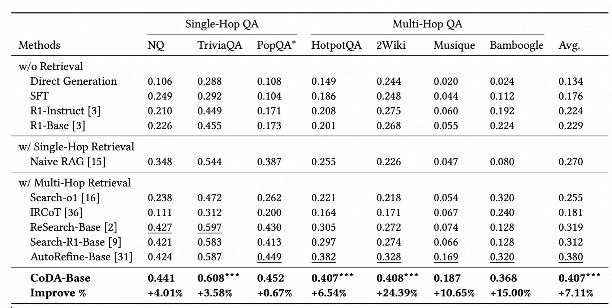
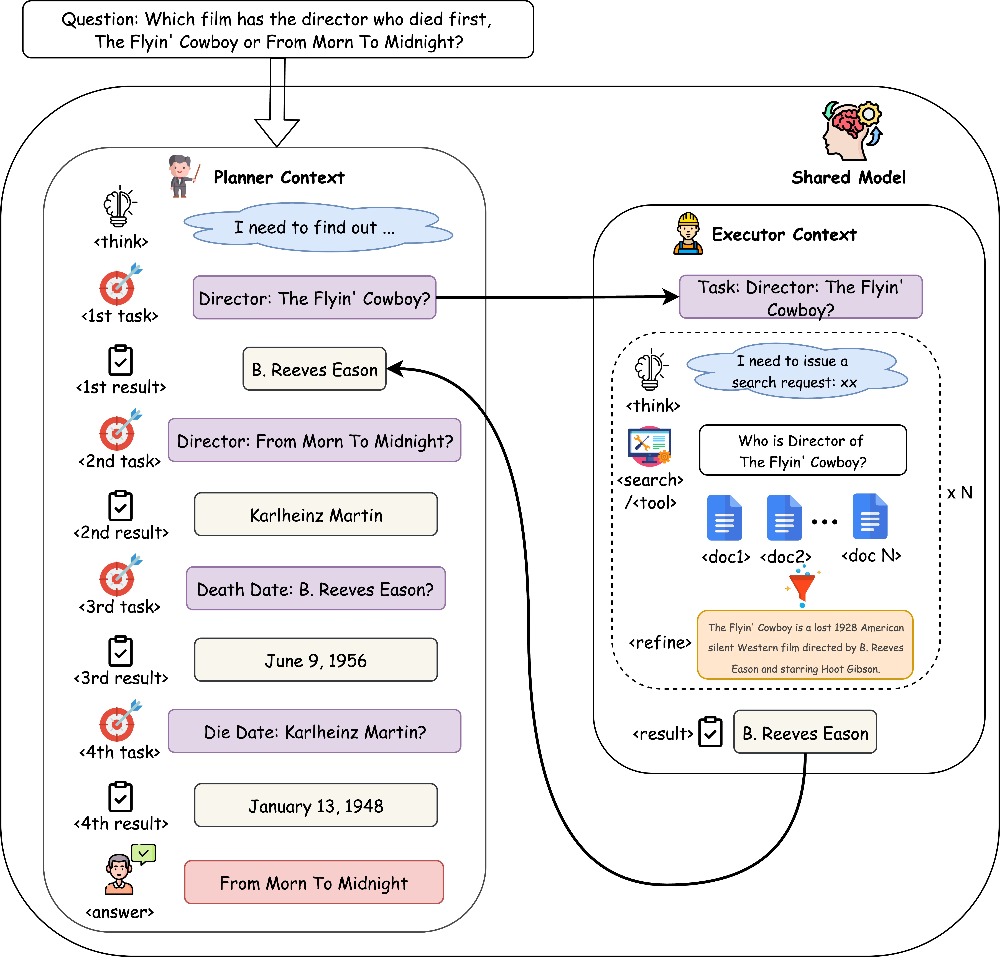

# 🤖 CoDA: Context-Decoupled Hierarchical Agent

<div align="center">

<!-- [](https://arxiv.org/abs/2505.11277) -->
[](LICENSE)
[](https://www.python.org/)
[](https://pytorch.org/)

**A Context-Decoupled Hierarchical Agent with Reinforcement Learning**

*Solving Context Explosion in LLM Agents through Hierarchical Architecture*

</div>

---

## 🎯 Overview

CoDA is a novel **Context-Decoupled Hierarchical Agent** framework that addresses the critical "Context Explosion" problem in LLM agents. By employing a single, shared LLM backbone that operates in two distinct, contextually isolated roles—a high-level **Planner** and a low-level **Executor**—CoDA achieves superior performance on complex multi-hop question-answering benchmarks while maintaining excellent robustness in long-context scenarios.

### 🚀 Key Innovations

- **Hierarchical Architecture**: Decouples high-level planning from low-level execution
- **Context Isolation**: Prevents strategic context pollution and execution redundancy
- **PECO Training**: Planner-Executor Co-Optimization via end-to-end reinforcement learning
- **Composite Rewards**: Multi-faceted reward system for optimal behavior learning


### 📊 Performance Highlights

CoDA achieves **state-of-the-art performance** across 7 QA benchmarks:

| Dataset | CoDA | AutoRefine | Improvement |
|---------|------|------------|-------------|
| **NQ** | **0.441** | 0.424 | +4.01% |
| **TriviaQA** | **0.608*** | 0.587 | +3.58% |
| **HotpotQA** | **0.407*** | 0.382 | +6.54% |
| **2WikiMultiHopQA** | **0.408*** | 0.328 | +24.39% |
| **Musique** | **0.187** | 0.169 | +10.65% |
| **Average** | **0.407*** | 0.380 | +7.11% |

*Bold denotes best results; *** indicates statistical significance*




## 🏗️ Architecture

### Core Components

<div align="center">

</div>

CoDA employs a **single shared LLM** that learns to operate in two distinct roles:

#### 🧠 **Planner (High-Level Strategist)**
- **Role**: Operates in a concise **Strategic Context** 𝐶ₚ
- **Function**: Decomposes complex tasks into manageable sub-tasks
- **Context**: {Q, (task₁,result₁), ..., (taskₜ₋₁,resultₜ₋₁)}
- **Output**: Sequence of executable sub-tasks or final answer

#### ⚡ **Executor (Focused Task Handler)**
- **Role**: Operates in an **Ephemeral Execution Context** 𝐶ᴇ
- **Function**: Handles tool interactions and information synthesis
- **Context**: Reinitialized for each sub-task {taskₜ}
- **Output**: Condensed results passed back to Planner

### 🔄 PECO Training Methodology

**Planner-Executor Co-Optimization** enables end-to-end reinforcement learning:

1. **Hierarchical Trajectory Generation**: Generate planning and execution trajectories
2. **Group-Level Credit Assignment**: Apply unified rewards across all trajectories
3. **Context-Dependent Policy Updates**: Train with role-specific context masking

### 🎯 Composite Reward System

CoDA uses a multi-faceted reward function:
- **Answer Correctness (R_ans)**: F1 score between prediction and ground truth
- **Format Compliance (R_format)**: Rewards proper XML tag usage
- **Refinement Quality (R_refine)**: Incentivizes effective information distillation

## 🛠️ Installation

### Main Environment

```bash
# Create and activate conda environment
conda create -n coda python=3.9
conda activate coda

# Install PyTorch
pip install torch==2.4.0 --index-url https://download.pytorch.org/whl/cu121

# Install vLLM for fast inference
pip3 install vllm==0.5.4

# build verl
pip install -e .

# Install Flash Attention 2
pip install flash-attn==2.7.0.post2

# Install Weights & Biases for logging
pip install wandb
```

### Retrieval Environment

```bash
# Create separate environment for retrieval server
conda create -n retrieval_env python=3.10
conda activate retrieval_env

# Install PyTorch with CUDA
conda install pytorch==2.4.0 torchvision==0.19.0 torchaudio==2.4.0 pytorch-cuda=12.1 -c pytorch -c nvidia

# Install retrieval dependencies
pip install transformers datasets pyserini
conda install -c pytorch -c nvidia faiss-gpu=1.8.0
pip install uvicorn fastapi
```

## 🚀 Quick Start

Command Line Inference

For direct inference without the web interface:

```bash
conda activate coda
python infer.py
```
Please refer to the [Retrieval Corpus](#retrieval-corpus) section for the preparation of the retrieval corpus.
This won't take long if your internet connection is good.

Customize your questions and parameters by modifying `infer.py`.


## 📂Data Preparation

### Knowledge Base Setup

CoDA uses **Wikipedia (December 2018)** as its knowledge base for retrieval:

```bash
# Download and prepare retrieval corpus
cd preprocess
bash download_and_process.sh
```

### Training & Evaluation Datasets

We evaluate CoDA on **7 diverse QA benchmarks**:

| Dataset | Type | Description |
|---------|------|-------------|
| **NQ** | Single-hop | Natural Questions |
| **TriviaQA** | Single-hop | Trivia questions |
| **PopQA** | Single-hop | Popular questions |
| **HotpotQA** | Multi-hop | Wikipedia-based reasoning |
| **2WikiMultiHopQA** | Multi-hop | Two-hop Wikipedia questions |
| **Musique** | Multi-hop | Complex multi-hop reasoning |
| **Bamboogle** | Multi-hop | Challenging multi-hop tasks |

Download and prepare datasets:
```bash
# Download from FlashRAG Collection
bash preprocess/scripts/data_process.sh
```

This script merges NQ and HotpotQA training sets, and combines test/dev sets from all 7 benchmarks.

## 🚀 Training & Evaluation

### Start Retrieval Server

Before training or evaluation, launch the retrieval server:
```bash
conda activate retrieval_env
bash retrieval_launch.sh
```
This starts the server at `http://127.0.0.1:8000/retrieve`.

### 🏋️ Training

Train CoDA to reproduce paper results:
```bash
conda activate coda
bash cmd/train.sh
```

**Training Details:**
- **Duration**: 300 steps
- **Checkpoints**: Saved for highest reward and evaluation accuracy
- **Logging**: Optional Weights & Biases integration

For W&B logging, set environment variables:
```bash
export WANDB_TOKEN=your_token
export WANDB_PROJECT=CoDA-Training
```

### 🧪 Evaluation

Evaluate trained model:
```bash
conda activate coda
bash cmd/eval.sh
```

### 📊 Key Experimental Results

#### Long-Context Robustness


CoDA demonstrates superior robustness compared to AutoRefine, maintaining stable performance as context length increases.

#### Ablation Studies
- **Hierarchical Structure**: +7.11% average improvement
- **PECO Training**: +8% F1 improvement over prompt-based baseline
- **Composite Rewards**: Essential for structured behavior learning

### 🔧 Configuration

Key hyperparameters from the paper:
- **Model**: Qwen2.5-3B-Base
- **Optimizer**: GRPO with KL regularization
- **Reward Components**: Answer correctness, format compliance, refinement quality
- **Context Length**: Variable (ephemeral for Executor, strategic for Planner)

## 🤝 Related Work & Acknowledgments

CoDA builds upon several foundational projects in the LLM agent and retrieval-augmented reasoning space:

### Core Dependencies
- **[VeRL](https://github.com/volcengine/verl)**: RL training framework
- **[Search-R1](https://github.com/PeterGriffinJin/Search-R1)**: Search-enhanced reasoning
- **[AutoRefine](https://github.com/syr-cn/AutoRefine)**: Refinement After Search

### Inspirations
- **[Qwen2.5](https://github.com/QwenLM/Qwen2.5)**: Base language model
- **[FlashRAG](https://github.com/RUC-NLPIR/FlashRAG)**: Dataset collection
- **[vLLM](https://github.com/vllm-project/vllm)**: Fast inference engine

We sincerely thank the authors of these projects for their valuable contributions and open-source implementations that made CoDA possible.

## 📚 Citation

If you find CoDA useful in your research, please cite our paper:

```bibtex

```

### 📖 Full Paper
- **[arXiv]()**
- **[PDF Download]()**

---

<div align="center">

**CoDA: Solving Context Explosion in LLM Agents through Hierarchical Architecture**

⭐ **Star this repository** if you find it useful!

<!-- Fix the url here -->

[📧 Contact](#) | [🐛 Issues](https://github.com/) | [🗣️ Discussions](https://github.com/)

</div>